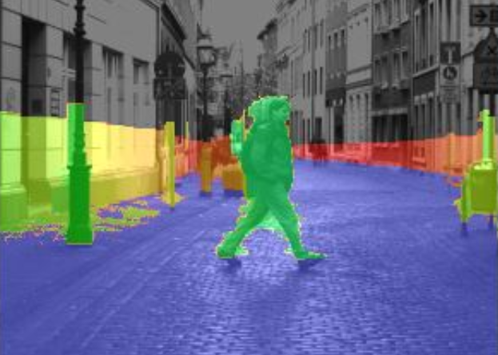

     

  
  
## Introduction  
#### StereoBM.create
`cv.StereoBM_create(numDisparities=0, blockSize=21) -> retval` - creates StereoBM object to compute disparity map from stereo pair

Inputs:
- `numDisparities`: _int_, the disparity search range. The maximum disparity minus minimum disparity (default is 0). Should be divisible by 16.
- `blockSize`: _int_, the linear size of the blocks compared by the algorithm when computing disparity (default is 21). Should be odd and must be more than 1 (i.e. 3,5,7,...).

Outputs:
- `retval`: _StereoBM object_, instance of StereoBM

#### stereo.compute
`stereo.compute(left, right) -> disparity` - computes the disparity map for the specified stereo pair

Inputs:
- `left`: _mxn numpy array_, left image from the stereo pair
- `right`: _mxn numpy array_, right image from the stereo pair

Outputs:
- `disparity`: _mxn numpy array_, computed disparity map

Notes:
- Before calling this method, you should create an instance of the stereo matcher (e.g., using `cv.StereoBM.create` or `cv.StereoSGBM.create`).
- The resulting disparity map can be normalized and converted to an appropriate format for visualization.

#### StereoSGBM.create
`cv.StereoSGBM_create(minDisparity=0, numDisparities=16, blockSize=3, P1=0, P2=0, disp12MaxDiff=0, preFilterCap=0, uniquenessRatio=0, speckleWindowSize=0, speckleRange=0, mode=cv.StereoSGBM_MODE_SGBM) -> retval` - creates a StereoSGBM object to compute disparity map from stereo pair

Inputs:
- `minDisparity`: _int_, minimum possible disparity value (default is 0)
- `numDisparities`: _int_, the disparity search range. The maximum disparity minus minimum disparity. It's always greater than 0 and should be divisible by 16 (default is 16)
- `blockSize`: _int_, the linear size of the blocks compared by the algorithm when computing disparity (default is 3)
- `P1`: _int_, penalty on the disparity change by plus or minus 1 between neighbor pixels (default is 0)
- `P2`: _int_, penalty on the disparity change by more than 1 between neighbor pixels. The algorithm requires `P2 > P1` (default is 0)
- `disp12MaxDiff`: _int_, maximum allowed difference (in integer pixel units) in the left-right disparity check (default is 0)
- `preFilterCap`: _int_, truncates disparity values falling outside of `[-preFilterCap, preFilterCap]` range (default is 0)
- `uniquenessRatio`: _int_, margin in percentage by which the best computed cost function value should "win" the second best value to consider the found match correct. Helps to remove false matches (default is 0)
- `speckleWindowSize`: _int_, maximum size of smooth disparity regions to consider their noise speckles and invalidate (default is 0)
- `speckleRange`: _int_, maximum disparity variation within the specified window (default is 0)
- `mode`: _int_, sets the algorithm mode. 
    - `cv.StereoSGBM_MODE_SGBM`: Basic full-scale 2-pass dynamic programming algorithm. Most accurate but slowest.
    - `cv.StereoSGBM_MODE_HH`: Uses Hirschmuller algorithm (HH). Faster than SGBM with higher memory requirement.
    - `cv.StereoSGBM_MODE_SGBM_3WAY`: Three-way optimized version of SGBM. Faster, less memory, possibly less accurate.
    - `cv.StereoSGBM_MODE_HH4`: SIMD optimized version of HH. Balances speed and accuracy with hardware acceleration.
    - `cv.StereoSGBM_MODE_QUARTER`: Outputs disparity map scaled down by a factor of 4 in height and width. Fastest with lowest resolution.

Outputs:
- `retval`: _StereoSGBM object_, instance of StereoSGBM
